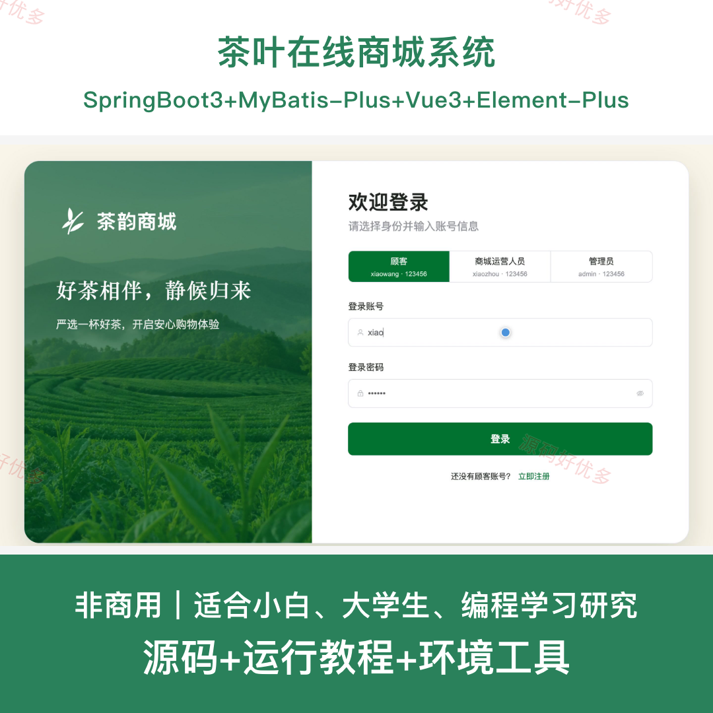
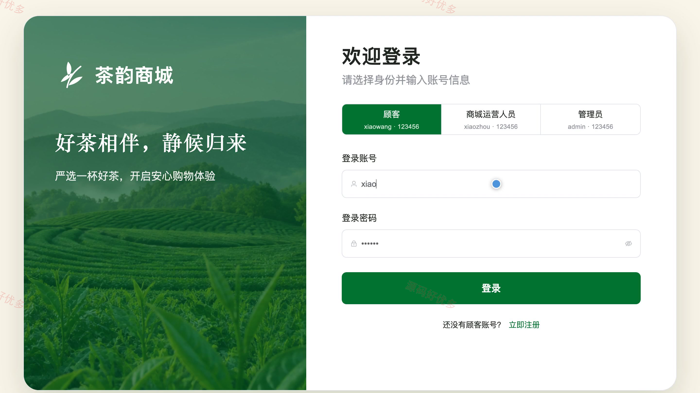
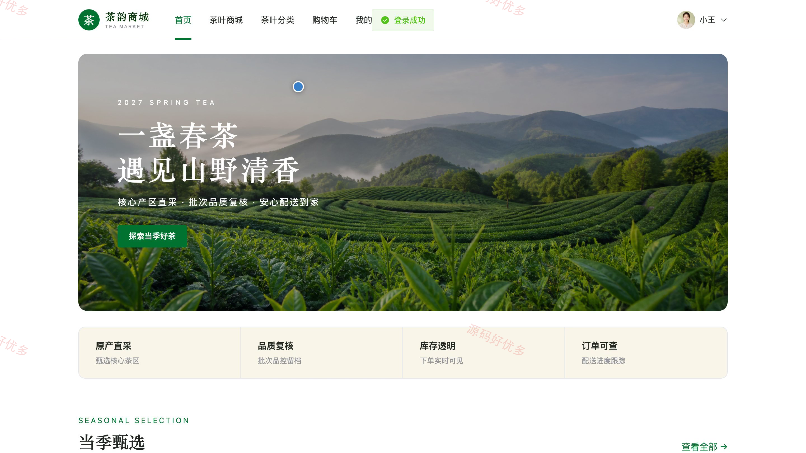
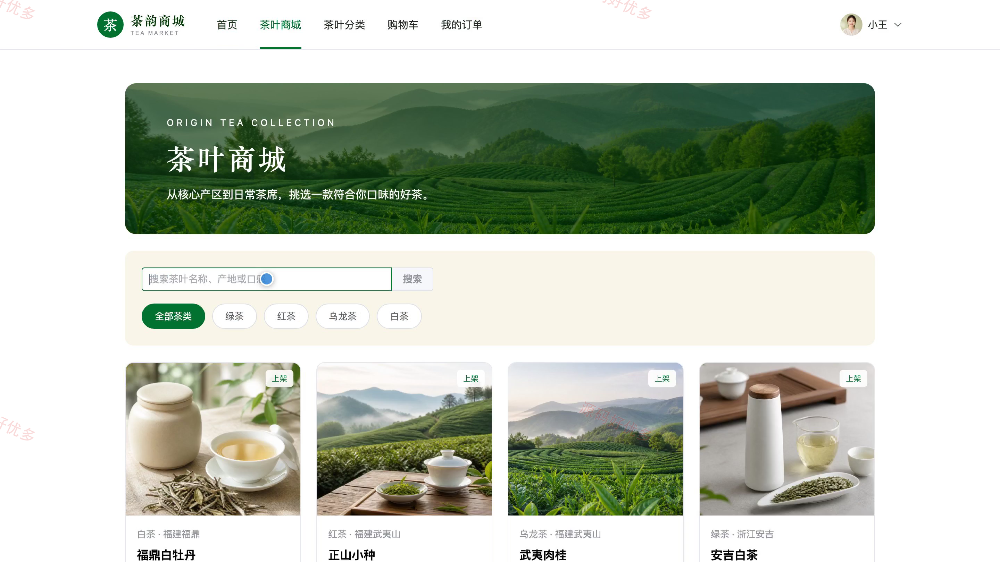
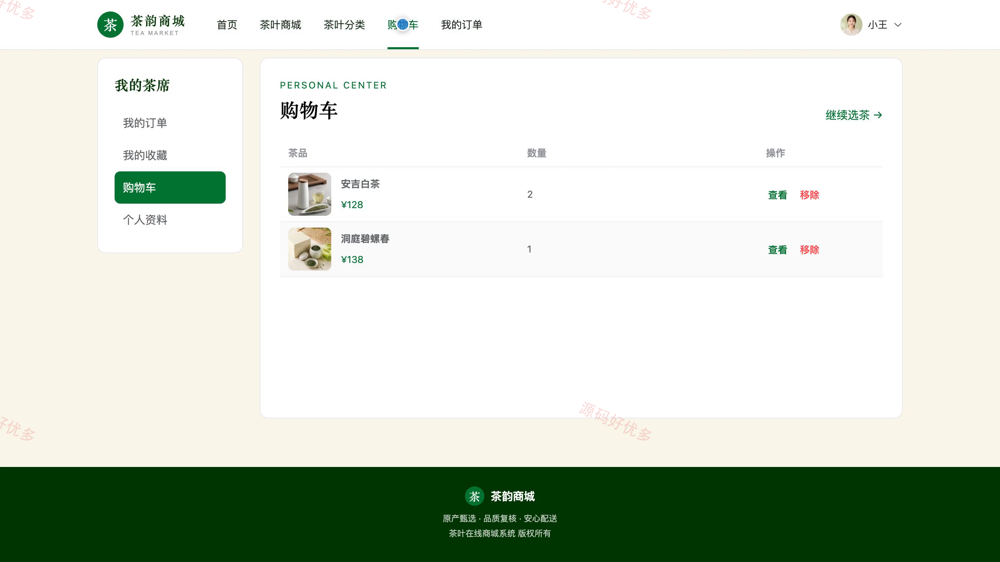
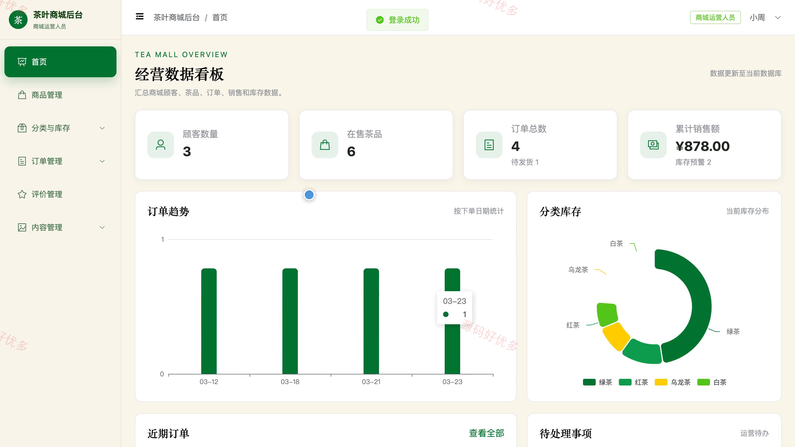
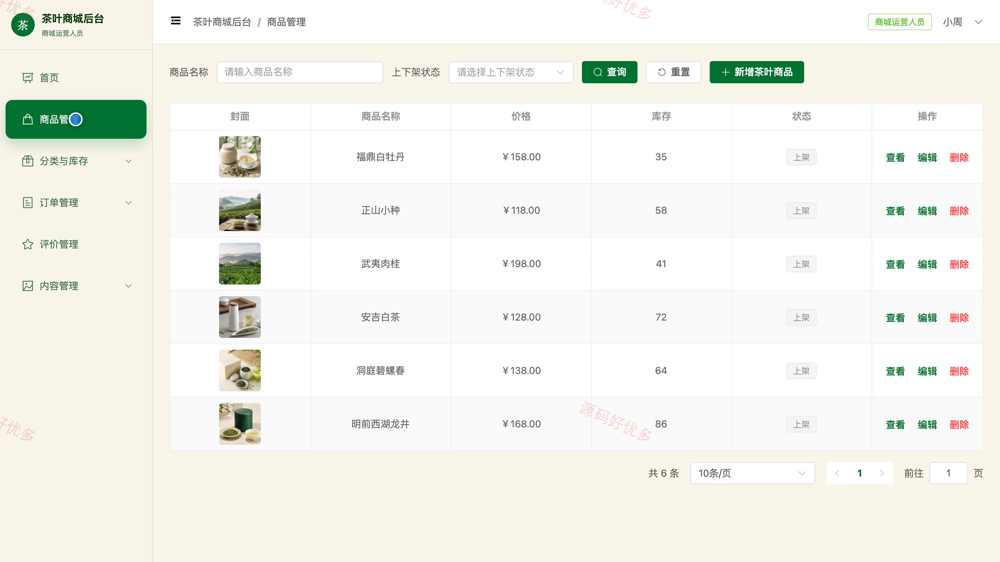
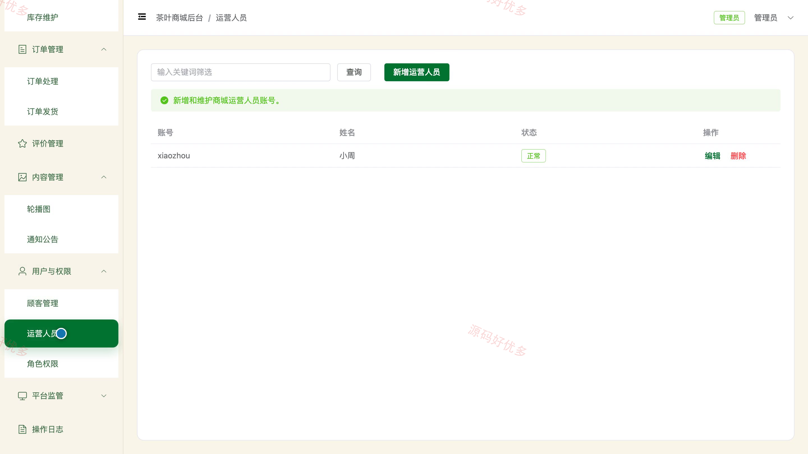
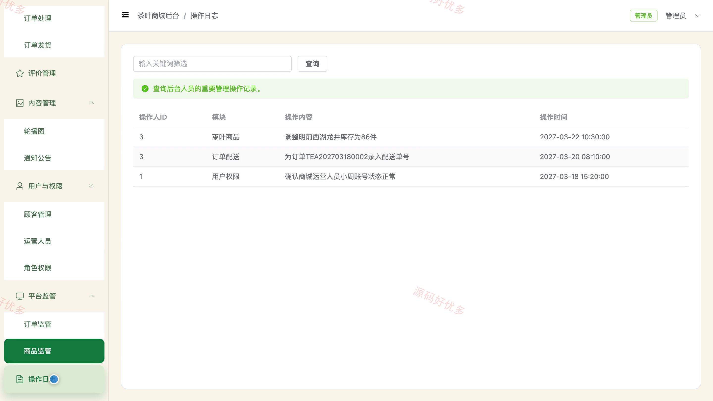

## 源码问题查看主页咨询

### 一、关键词
茶叶商城、茶叶电商、网上购茶、茶品零售、茶叶购物

### 二、作品包含
源码+数据库+万字设计文档+PPT+全套环境和工具资源+本地部署教程

### 三、项目技术
前端技术： Html、Css、Js、Vue3.4、Element-Plus
后端技术：Java、SpringBoot3.2.0、MyBatis-Plus

### 四、运行环境（以下版本亲测，其他版本兼容性请自行测试）
开发工具：IDEA/eclipse + VSCODE

数据库：MySQL5.7+（共16张表）

数据库管理工具：Navicat10以上版本

环境配置软件： JDK17 + Maven

前端Nodejs：16+

浏览器：谷歌浏览器

### 五、项目介绍
项目编号：bs065A

系统面向线上选购茶叶的客户、商城运营人员与管理员，覆盖茶品浏览筛选、收藏购物车、订单提交与查询、商品评价，以及茶叶商品、分类、库存、订单发货、内容公告、角色权限和平台统计管理，形成从选购到履约评价的商城业务闭环。

角色：客户、商城运营人员、管理员

客户功能：注册登录、茶叶选购检索、商品浏览与互动、购物车管理、提交订单、订单查询。

商城运营人员功能：茶叶商品管理、茶叶分类管理、库存维护、订单处理、订单发货、评价管理、轮播公告管理、销售统计。

管理员功能：商城运营管理、顾客管理、运营人员管理、角色权限管理、订单监管、商品监管、平台统计、操作日志。

### 六、运行截图

